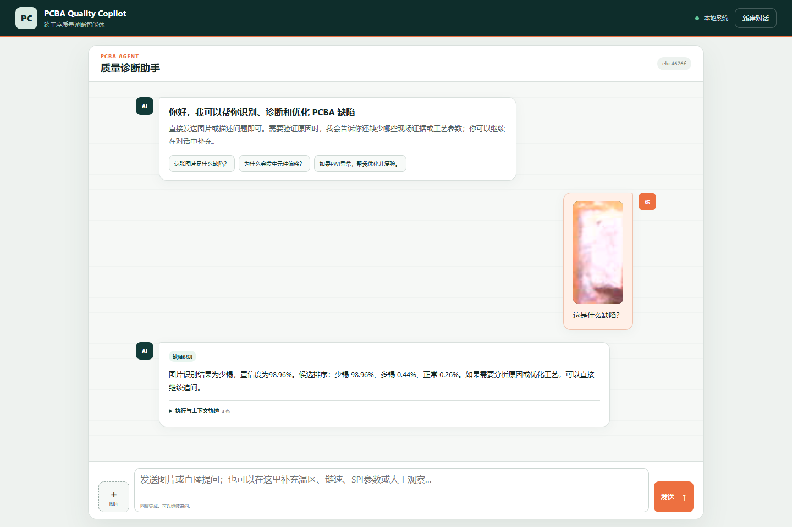
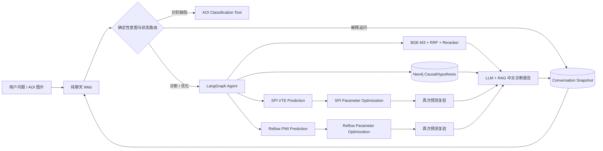

<div align="center">

# PCBA Quality Copilot

### 从一张焊点图片，到可追溯的致因诊断、工艺优化与复验

一个面向 PCBA 制造现场的跨工序质量诊断智能体。它把 AOI 缺陷识别、工业知识 RAG、Neo4j 致因图谱、SPI / 回流焊预测模型和参数优化 Tool 编排成可连续追问的工程闭环。


</div>



> 截图来自真实运行：用户上传焊点图片后，系统直接调用 AOI，识别为少锡并返回 `98.96%` 置信度与 Top-3 候选。

## 它解决什么问题

传统缺陷识别通常停留在“这是什么”，普通 RAG 又常停留在“检索到几段资料”。本项目继续回答制造现场真正关心的问题：

- 这个缺陷有哪些候选致因，分别属于哪个工序？
- 当前现场数据能否支持或否定某条致因路径？
- 应该调用 SPI 还是回流焊模型，还缺哪些参数？
- 参数优化后是否真的回到合格窗口？
- 每个结论来自哪条知识证据、图谱关系和 Tool 结果？

系统不会把候选原因包装成“唯一根因”。知识证据、工艺模型和人工观察各自承担不同角色，不确定性会被明确保留。

## 为什么它不只是一个聊天 Demo

| 能力 | 工程实现 |
|---|---|
| 看见缺陷 | EfficientNet AOI 服务识别少锡、多锡、短路/桥连、元件偏移，并返回置信度与候选排序 |
| 理解问题 | Qwen 负责语义意图和显式参数抽取；Tool 选择、缺失项和状态跳转由代码确定性控制 |
| 找到证据 | BGE-M3 Dense + Sparse RRF、BGE Reranker 与固定权重排名融合，返回原文、页码和检索轨迹 |
| 组织致因 | Neo4j 返回多条 `CausalHypothesis`，包含工序、强度、验证指标、Tool 和下一验证动作 |
| 验证现场 | SPI VTE 与回流 PWI 预测 Tool 对候选路径进行样本级验证，而不是用通用知识替代现场事实 |
| 闭环优化 | 只有预测确认异常才允许优化；推荐参数必须再次调用预测 Tool 复验，不合格就拒绝建议 |
| 连续对话 | SQLite 持久化消息、案例状态、证据和诊断快照；解释型追问复用上下文，不重复执行整条链路 |
| 可追溯运行 | 前端展示执行阶段、候选状态、知识引用、Tool轨迹、推荐参数及复验结果 |

## 系统架构



模型能力统一通过 `FastAPI → Agent Tool → LangGraph` 接入，Agent 不直接耦合模型内部实现。

## 已验证的真实闭环

| 场景 | 初始状态 | 优化与复验结果 |
|---|---:|---:|
| 少锡 / SPI | VTE `94.4844%` | 推荐参数复验 VTE `99.9999%`，`accepted` |
| 元件偏移 / 回流 | PWI `105.46` | 推荐参数复验 PWI `24.23`，合格 |
| 图片识别 | 用户截图样本 | 少锡 `98.96%`，两种同义问法返回一致结果 |

当前自动化验证包括：

- Agent / Web API：`32` 项测试通过；
- KG 契约与真实查询：`32` 项测试通过，Neo4j 中为 `28` 个节点、`40` 条关系；
- T15 最小系统集：`6` 个基础 Case + `1` 个 Tool 失败变体，Tool Recall / Precision、缺失输入识别、优化复验与安全降级均通过；
- 冻结 Retriever 主评测：Macro Recall@5 `0.762188`、MRR@10 `0.585714`。该小规模 Gold 未达到原目标，项目如实保留指标例外，而不是隐藏失败结果。

详细结果见 [T15系统评测](agent/evaluation/reports/T15_SYSTEM_EVALUATION.md) 与 [RAG冻结评测说明](rag/evaluation/README.md)。

## 支持范围

当前冻结四类缺陷：

```text
insufficient_solder  少锡
excessive_solder     多锡
short                短路 / 桥连
shifted_component    元件偏移
```

覆盖焊膏印刷、元器件贴装和回流焊三个工序。印刷与回流具备预测和参数优化能力；贴装路径保留为需要人工观察的候选，不会因为缺少 Tool 而被删除。

## 快速开始

### 1. 环境要求

- Windows 10 / 11 与 PowerShell；
- Conda 环境名称固定为 `PCB_Agent`，Python 3.11；
- Docker Desktop；
- 已测试 NVIDIA CUDA 环境；
- 可用的 Qwen OpenAI-compatible API。

### 2. 安装依赖

```powershell
git clone https://github.com/jixinzhou/PCBA_Agent.git
cd PCBA_Agent

conda create -n PCB_Agent python=3.11 -y
conda activate PCB_Agent

python -m pip install -r tool/requirements.txt
python -m pip install -r rag/requirements.txt
python -m pip install -r kg/requirements.txt
python -m pip install -r agent/requirements.txt
```

### 3. 配置本地凭据

```powershell
Copy-Item agent/.env.example agent/.env
Copy-Item kg/.env.example kg/.env
```

在 `agent/.env` 中配置 `QWEN_API_KEY` 与 `QWEN_BASE_URL`，并在 `kg/.env` 中设置本地 Neo4j 密码。真实 `.env` 已被 Git 忽略。

### 4. 首次初始化 KG 与 RAG

```powershell
docker compose --env-file kg/.env -f kg/docker-compose.neo4j.yml up -d
python kg/scripts/import_ontology.py --runs 2

docker compose -f rag/docker-compose.qdrant.yml up -d
python rag/scripts/run_full_page_pipeline.py
python rag/scripts/run_chunk_pipeline.py
python rag/scripts/run_metadata_pipeline.py
python rag/scripts/run_embedding_pipeline.py
python rag/scripts/run_qdrant_pipeline.py
docker compose -f rag/docker-compose.qdrant.yml stop
```

RAG 首次构建需要下载固定 revision 的 BGE 模型并生成本地派生索引，耗时取决于网络、GPU和文档解析速度。详细说明见 [RAG README](rag/README.md)；Neo4j 数据结构见 [KG README](kg/README.md)。

### 5. 启动聊天系统

```powershell
.\agent\scripts\start_web.ps1
```

脚本会启动或复用 Neo4j、Qdrant、AOI、SPI、Reflow 和 Agent Web，自动预热 RAG，并打开浏览器。默认使用 `8080`；若被占用，会从 `18080` 起寻找可用端口。

## 对话示例

```text
用户：［上传图片］这是什么缺陷？
Agent：图片识别结果为少锡，置信度为98.96%……

用户：为什么会发生这个缺陷？
Agent：需要验证“焊膏沉积或转移不足”候选路径，请补充刮刀压力、速度和脱模参数。

用户：刮刀压力8，刮刀速度37.5，脱模速度2，脱模距离0.6，请优化并复验。
Agent：SPI预测 → 参数优化 → SPI复验；VTE由94.4844%回到99.9999%，建议状态accepted。

用户：为什么支持这条路径？
Agent：复用上一轮诊断快照、Tool事实与RAG证据回答，不重新执行完整诊断。
```

## 目录结构

```text
agent/       LangGraph编排、Qwen适配、会话状态、本地Web与系统评测
tool/        AOI、SPI、回流焊模型服务及框架无关Agent Tool
rag/         文档解析、Chunk、Embedding、Qdrant、Retriever与冻结评测
kg/          Neo4j图契约、幂等导入和候选致因查询
ontology/    缺陷致因本体唯一事实源
docs/        项目状态、任务、长期决策和界面素材
```

## API 与工程边界

- Swagger：`/docs`
- 健康检查：`GET /health`
- 图片上传：`POST /api/v1/agent/images`
- 原始 Agent：`POST /api/v1/agent/invoke`
- 会话消息任务：`POST /api/v1/conversations/{id}/message-jobs`
- 运行时日志、上传图片、SQLite、向量库和真实凭据均不进入 Git；
- 参数建议只供人工审核，系统不会写入生产设备；
- 知识库参考资料的版权状态记录在 `rag/config/sources.v0.1.yaml`。使用者应自行确认其内部使用与再分发权限。

## 当前状态与路线图

当前版本是已完成真实本地闭环验证的个人项目工程版。下一阶段包括：

- 将 Neo4j、Qdrant、三套模型服务与 Agent Web 统一为完整 Docker 部署；
- 扩大带现场 Gold 的系统评测集；
- 增加更多缺陷、贴装侧验证 Tool 与生产级鉴权；
- 增加可观测性、任务队列与多用户会话隔离。

项目的设计原则、当前状态与任务记录分别见 [PROJECT](docs/PROJECT.md)、[STATUS](docs/STATUS.md)、[TASKS](docs/TASKS.yaml) 和 [DECISIONS](docs/DECISIONS.md)。
